# SISOP-1-2026-IT-008

Silfi Rochmatul Auliyah (5027251008)

---

## Reporting

### Soal 1
#### Penjelasan 
Pada soal ini diminta untuk membantu Pak Rusdi, seorang kondektur magang untuk menyusun laporan lengkap mengenai penumpang kereta dengan menganalisis data dalam file `passenger.csv` menggunakan command linux dan bantuan awk. 

Analisis data yang diminta untuk laporan adalah sebagai berikut. 
1. Total penumpang kereta 
2. Total gerbong kereta
3. Menemukan penumpang dengan usia tertua di kereta
4. Rata-rata usia penumpang kereta
5. Total penumpang Business Class

Sebelum menganalisis data, langkah pertama adalah mengunduh file `passenger.csv` kemudian menempatkannya pada folder yang sama dengan `KANJ.sh`. 

Selanjutnya karena script ini dijalankan dengan menerima argumen dari user yaitu `awk -f KANJ.sh passenger.csv (a/b/c/d/e)`, maka argumen tersebut diakses menggunakan variabel bawaan awk yaitu `ARGV[2]` karena kata yang akan diambil terdapat dalam urutan ke [2]. Kemudian, argumen tersebut disimpan ke dalam variabel `pilihan`. 
```sh 
BEGIN {
	FS=","
	pilihan = ARGV[2]
	delete ARGV[2]
      }
```
Kemudian proses analisis data adalah sebagai berikut.

```sh
	  #--a--
      NR>1 && pilihan == "a" {count++}

      #--b--
      NR>1 && pilihan == "b" {gsub(/\r/, "", $4); gerbong[$4]++}

      #--c--
      NR>1 && pilihan == "c" {if ($2 > max) {max = $2; nama = $1}}

      #--d--
      NR>1 && pilihan == "d" {sum+=$2; count++}

      #--e--
      NR>1 && pilihan == "e" && $3 == "Business" {kelas++}

      END {
            if (pilihan == "a") print "Jumlah seluruh penumpang KANJ adalah", count, "orang"

            else if (pilihan == "b") print "Jumlah gerbong penumpang KANJ adalah", length(gerbong)

            else if (pilihan == "c") print nama, "adalah penumpang kereta tertua dengan usia", max, "tahun"

            else if (pilihan == "d") printf "Rata-rata usia penumpang adalah %.0f tahun", sum/count

            else if (pilihan == "e") print "Jumlah penumpang business class ada", kelas, "orang"

            else print  "Soal tidak dikenali. Gunakan a, b, c, d, atau e.\n" "Contoh penggunaan: awk -f KANJ.sh passenger.csv (a/b/c/d/e)"
} 
```

Berikut penjelasan mengenai setiap bagian analisis data.

**a. Menghitung seluruh baris data penumpang dan menyusun laporan**

Untuk langkah pertama dalam analisis data adalah menghitung baris data penumpang dalam file dengan mengecualikan header. 
```sh 
NR>1 && pilihan == "a" {count++}
```
Setelah jumlah penumpang didapat, kemudian mencatat jumlah yang diperoleh dalam laporan. 
```sh
if (pilihan == "a") print "Jumlah seluruh penumpang KANJ adalah", count, "orang"
```

**b. Menghitung total gerbong kereta**

Untuk langkah keduanya adalah menghitung jumlah gerbong KANJ dalam file dengan menyimpan nilai setiap gerbong dan mengecualikan header. Nilai  setiap gerbong disimpan sebagai kunci di dalam array gerbong[] agar tidak terhitunng dua kali. 
```sh
NR>1 && pilihan == "b" {gsub(/\r/, "", $4); gerbong[$4]++}
```
Setelah jumlah gerbong didapat, kemudian jumlah gerbong dicatat dalam laporan.
```sh
else if (pilihan == "b") print "Jumlah gerbong penumpang KANJ adalah", length(gerbong)
```

**c. Menemukan penumpang dengan usia tertua di kereta**

Untuk langkah ketiga adalah membandingkan usia setiap penumpang kereta untuk menemukan penumpang dengan usia tertua. 
```sh
NR>1 && pilihan == "c" {if ($2 > max) {max = $2; nama = $1}}
```
Setelah nama dan umur penumpang tertua didapat, kemudian nama dan umur tersebut dicatat dalam laporan.
```sh
else if (pilihan == "c") print nama, "adalah penumpang kereta tertua dengan usia", max, "tahun"
```

**d. Menghitung rata-rata usia penumpang kereta**

Untuk langkah keempat adalah menghitung rata-rata usia dengan menghitung baris usia dan baris total penumpang kemudian membaginya. 
```sh
NR>1 && pilihan == "d" {sum+=$2; count++}
```
Setelah rata-rata usia didapatkan, kemudian rata-rata usia dicatat dalam bentuk bilangan bulat dalam laporan. 
```sh
else if (pilihan == "d") printf "Rata-rata usia penumpang adalah %.0f tahun", sum/count
```

**e. Menghitung jumlah penumpang business class**

Untuk langkah kelima adalah menghitung jumlah penumpang business class dengan memfilter baris kelas bernilai "Business". 
```sh
NR>1 && pilihan == "e" && $3 == "Business" {kelas++}
```
Setelah mendapatkan jumlahnya, kemudian jumlah penumpang business class dicatat dalam laporan. 
```sh
else if (pilihan == "e") print "Jumlah penumpang business class ada", kelas, "orang"
```
 
Apabila opsi yang dimasukkan saat menjalankan program adalah selain a/b/c/d/e maka akan menjalankan perintah berikut. 
```sh
else print  "Soal tidak dikenali. Gunakan a, b, c, d, atau e.\n" "Contoh penggunaan: awk -f KANJ.sh passenger.csv (a/b/c/d/e)"
```

#### Output 
1. Mengunduh file passenger.csv 

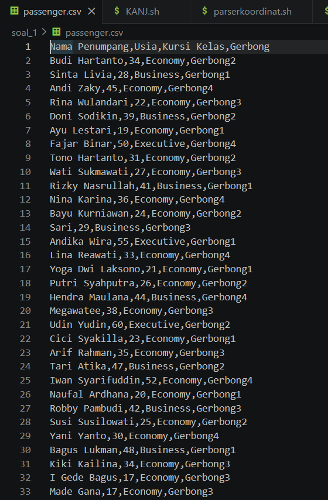

2. opsi a - menampilkan laporan jumlah seluruh penumpang KANJ

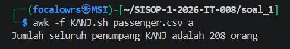

3. opsi b - menampilkan laporan jumlah gerbong KANJ

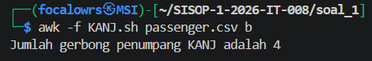

4. opsi c - menampilkan laporan penumpang tertua KANJ

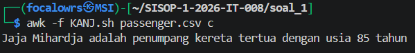

5. opsi d - menampilkan laporan rata-rata usia penumpang 

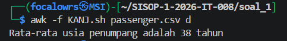

6. opsi e - menampilkan laporan jumlah penumpang business class

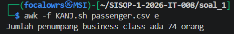

7. Jika memasukkan opsi selain a/b/c/d/e

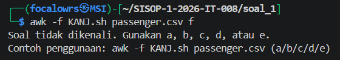

#### Kendala
Tidak ada kendala


### Soal 2
#### Penjelasan 
Pada soal kedua, diminta untuk membantu mencari benda pusaka dengan mengikuti alur ekspedisi pencarian benda pusaka. 

Untuk langkah pertama adalah menyiapkan perlengkapan ekspedsi dengan menginstall package gdown untuk mengunduh file pdf dari google drive. Setelah menginstall gdown, selanjutnya adalah mengunduh file pdf `peta-ekspedisi-amba` dengan menggunakan tools gdown. Kemudian file tersebut dimasukkan ke dalam folder ekspedsi.  

```bash 
gdown https://drive.google.com/uc?id=1q10pHSC3KFfvEiCN3V6PTroPR7YGHF6Q
```

Langkah selanjutnya adalah melihat isi file tersebut dengan menggunakan perintah `cat` untuk mendapatkan tautan github yang tersembunyi di dalam file. Setelah mendapatkan tautan github tersembunyi, selanjutnya tautan tersebut diunduh dengan menduplikasi menggunakan perintah `git clone` agar mendapatkan file yang ada di dalamnya. 

```bash
cat peta-ekspedisi-amba.pdf
git clone https://github.com/pocongcyber77/peta-gunung-kawi.git
```

Dari repository yang diunduh terdapat file gsxtrack.json yang berisi titik lokasi bekas ekspedisi sebelumnya. Lokasi benda pusaka yang dicari tepat berada di titik tengah lokasi-lokasi tersebut. Oleh karena itu, untuk mendapatkan titik tengah tersebut diperlukan mengekstrak data titik lokasi agar lebih mudah dibaca kemudian menentukan titik tengahnya dengan bantuan awk. 

**a. Parsing titik koordinat**

File gsxtrack.json diekstrak dengan membuat script `parserkoordinat.sh` dan menggunakan awk dengan regex. Di sini awk mencocokkan setiap field yang berada di baris terpisah dengan mencocokkan pola kemudian mengambil nilainya. Nilai yang akan diambil dari file json ada empat di antaranya id, site_name, latitude, dan longitude. Keempat nilai tersebut akan digabung dan disimpan dalam satu baris. Kemudian setiap nilai yang cocok akan disimpan ke dalam file baru bernama `titik-penting.txt` dengan format id,site_name,latitude,longitude.
```shell
awk '/"id"/ {gsub(/.*"id": "|",/, "", $0); id = $0} \
     /"site_name"/ {gsub(/.*"site_name": "|",/, "", $0); site_name = $0} \
     /"latitude"/ {gsub(/.*"latitude": |,/, "", $0); latitude = $0} \
     /"longitude"/ {gsub(/.*"longitude": |,/, "", $0); longitude = $0; print id","site_name","latitude","longitude}' \
     gsxtrack.json > titik-penting.txt
```

**b. Menentukan titik pusat**

Berdasarkan file gsxtrack.json, keempat titik koordinat yang ada membentuk sebuah persegi. Oleh karena itu, untuk menemukan titik pusat dari keempat titik tersebut dapat menggunakan rumus titik tengah persegi. 

$$\left(\frac{x_1 + x_2}{2}, \frac{y_1 + y_2}{2}\right)$$

Koordinat yang  digunakan merupakan koordinat yang saling berseberangan. Pada rumus tersebut longitude bernilai sama dengan x dan latitude sama dengan y. Setelah menghitung titik tengah, outputnya akan disimpan ke dalam file `posisipusaka.txt` dengan format (Latitude, Longitude).
```shell
awk -F',' 'NR == 1 {lat1=$3; lon1=$4}
	       NR == 3 {lat2=$3; lon2=$4}
END {
      longitude_pusat = (lon1 + lon2) / 2
      latitude_pusat = (lat1 + lat2) / 2 
      print "Koordinat pusat: " latitude_pusat "," longitude_pusat
}' titik-penting.txt > posisipusaka.txt
```

#### Output 
1. Hasil parsing titik koordinat
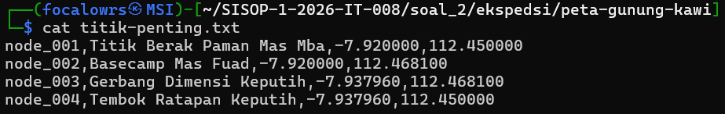

2. Posisi pusaka 
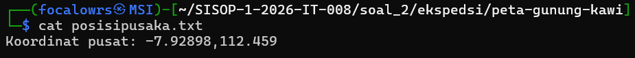

#### Kendala
Kendala yang ditemui pada soal ini adalah pada bagian pembuatan script `parserkoordinat.sh`, khususnya dalam memahami penggunaan regex untuk mengekstrak nilai dari file json menggunakan awk. Pola seperti `/.*"id": "|",/` awalnya sulit dipahami karena belum familiar dengan konsep pattern matching dan regex. 

### Soal 3
#### Penjelasan 
Pada soal ini diminta untuk membuat sistem manajemen kost slebew berbasis CLI interaktif menggunakan bash script dan bantuan awk. Sistem ini dibuat dalam satu file script `kost_slebew.sh`. 

Terdapat 7 fitur dalam sistem ini.
1. Tambah Penghuni Baru
2. Hapus Penghuni
3. Tampilkan Daftar Penghuni
4. Update Status Penghuni
5. Cetak Laporan Keuangan
6. Kelola Cron (Pengingat Tagihan)
7. Exit Program

Langkah pertama adalah membuat antar muka berupa menu utama yang interaktif dan terus melakukan looping hingga pengguna memilih opsi exit. 
```shell
echo '  _  __         _    _____ _      _                   '
echo ' | |/ /        | |  / ____| |    | |                  '
echo ' | '"'"' / ___  ___| |_| (___ | | ___| |__   _____      __'
echo ' |  < / _ \/ __| __|\___ \| |/ _ \ '"'"'_ \ / _ \ \ /\ / /'
echo ' | . \ (_) \__ \ |_ ____) | |  __/ |_) |  __/\ V  V / '
echo ' |_|\_\___/|___/\__|_____/|_|\___|_.__/ \___| \_/\_/  '

while true; do 
    echo ""
    echo "========================================"
    echo "     SISTEM MANAJEMEN KOST SLEBEW      "
    echo "========================================"
    echo " ID | OPTION"
    echo "----------------------------------------"
    echo "  1 | Tambah Penghuni Baru"
    echo "  2 | Hapus Penghuni"
    echo "  3 | Tampilkan Daftar Penghuni"
    echo "  4 | Update Status Penghuni"
    echo "  5 | Cetak Laporan Keuangan"
    echo "  6 | Kelola Cron (Pengingat Tagihan)"
    echo "  7 | Exit Program"
    echo "========================================"
    echo -n "Enter option [1-7]: "
    read pilihan
```

Langkah selanjutnya adalah membuat script untuk setiap opsi yang ada. Berikut penjelasan masing-masing opsi pada menu sistem manajemen kost  slebew. 

**1.Tambah penghuni baru**

Fitur yang pertama adalah fitur untuk menambah penghuni baru. Pada fitur ini membutuhkan input nama, kamar, harga sewa, tanggal masuk, dan status awal. 
```shell
if [ "$pilihan" == "1" ]; then
        echo "========================================"
        echo "            TAMBAH PENGHUNI             "
        echo "========================================"
        echo -n "Masukkan nama: "
        read nama
        echo -n "Masukkan kamar: "
        read kamar
            if grep -q ",$kamar," data/penghuni.csv; then
                echo "Kamar tidak tersedia."
                continue
            else 
                echo "Kamar tersedia"
            fi
        echo -n "Masukkan harga sewa: "
        read harga 
            if ! echo "$harga" | grep -qE '^[0-9]+$'; then 
                echo "Harga sewa tidak valid."
                continue
            fi 
        echo -n "Masukkan tanggal masuk: "
        read tanggal
            if ! echo "$tanggal" | grep -qE '^[0-9]{4}-[0-9]{2}-[0-9]{2}$'; then
                echo "Format tanggal harus YYYY-MM-DD"
                continue
            fi
            today=$(date +%s)
            input=$(date -d "$tanggal" +%s)
            if [ -z "$input" ]; then
                echo "Tanggal tidak valid."
                continue
            fi
            if [ "$input" -gt "$today" ]; then
                echo "Tanggal tidak valid."
                continue
            fi
        echo -n "Masukkan status awal (Aktif/Menunggak): "
        read status
            if [ "$status" != "Aktif" ] && [ "$status" != "Menunggak" ]; then
                echo "Status harus Aktif/Menunggak."
                continue
            fi
        echo "$nama,$kamar,$harga,$tanggal,$status" >> data/penghuni.csv
        echo "Penghuni $nama berhasil ditambahkan ke kamar $kamar dengan status $status."
```
Pada fitur ini terdapat beberapa validasi di antaranya.

a. Validasi format tanggal

Format tanggal tidak boleh melebihi hari ini dan harus dalam format (YYYY-MM-DD)
```shell
	if ! echo "$tanggal" | grep -qE '^[0-9]{4}-[0-9]{2}-[0-9]{2}$'; then
                echo "Format tanggal harus YYYY-MM-DD"
                continue
            fi
```
b. Validasi harga

Harga yang dimasukkan haruslah angka positif dan tidak boleh negatif.
```shell
 if ! echo "$harga" | grep -qE '^[0-9]+$'; then 
                echo "Harga sewa tidak valid."
                continue
            fi 
```
c. Validasi nomor kamar

Nomor kamar yang dimasukkan harus divalidasi agar mengetahui apakah kamar tersebut tersedia atau telah disewa penghuni lain. 
```shell
if grep -q ",$kamar," data/penghuni.csv; then
                echo "Kamar tidak tersedia."
                continue
            else 
                echo "Kamar tersedia"
            fi
```
d. Validasi status

Status yang dimasukkan harus sesuai aturan yakni Aktif/Menunggak.
```shell
if [ "$status" != "Aktif" ] && [ "$status" != "Menunggak" ]; then
                echo "Status harus Aktif/Menunggak."
                continue
            fi
```

Data yang sudah divalidasi kemudian akan disimpan ke dalam `data/penghuni.csv`.

**2. Hapus Penghuni**

Fitur ini berfungsi untuk menghapus baris data penghuni yang pindah. Namun, sebelum dihapus data penghuni lama akan dipindahkan ke dalam `sampah/history_hapus.csv` dengan tanggal penghapusan di kolom paling belakang. 
```shell
elif [ "$pilihan" == "2" ]; then 
        echo "========================================"
        echo "            HAPUS PENGHUNI              "
        echo "========================================"
        echo -n "Masukkan nama penghuni yang akan dihapus: "
        read nama 
        if grep -q "$nama" data/penghuni.csv; then
            baris=$(grep "$nama" data/penghuni.csv)
            today=$(date +%Y-%m-%d)
            echo "$baris,$today" >> sampah/history_hapus.csv
            
            grep -v "$nama" data/penghuni.csv > tmp.csv
            mv tmp.csv data/penghuni.csv
            echo "Data penghuni \"$nama\" berhasil diarsipkan ke sampah/history_hapus.csv dan dihapus dari sistem."
            echo "Tekan [ENTER] untuk kembali ke menu..."
            read
        else 
            echo "Penghuni dengan nama /"$nama/" tidak ditemukan."
        fi 
```

**3. Tampilkan Daftar Penghuni**

Fitur ini berfungsi untuk menampilkan daftar penghuni kost yang memanfaatkan awk untuk memformat file mentah menjadi sebuah tabel yang mudah dibaca. Selain itu, untuk harga sewa angkanya diubah menggunakan fungsi format_harga agar dapat memisahkan setiap 3 digit dengan operasi `%` dan menambahkan Rp di depannya. 
```shell
elif [ "$pilihan" == "3" ]; then 
        echo "==========================================================="
        echo "               DAFTAR PENGHUNI KOST SLEBEW           "
        echo "==========================================================="
        echo " No | Nama            | Kamar  | Harga Sewa   | Status       "
        echo "-----------------------------------------------------------"
        awk -F',' '
        function format_harga(n) {
        hasil = ""
        while (n >= 1000) {
            sisa = n % 1000
            n = int(n / 1000)
            hasil = "." sprintf("%03d", sisa) hasil
            }
        return "Rp" n hasil
        }
        {
            no++
            printf " %s  | %-15s | %-6s | %-12s | %s\n", no, $1, $2, format_harga($3), $5
            print "-----------------------------------------------------------"
        }' data/penghuni.csv
        awk -F',' '{
            total++
            if ($5 == "Aktif") aktif++
            else menunggak++
        } END {
            print "==========================================================="
            print "Total:", total, "| Aktif:", aktif, "| Menunggak:", menunggak
            print "==========================================================="
        }' data/penghuni.csv

        echo "Tekan [ENTER] untuk kembali ke menu..."
        read
```

**4. Update Status Penghuni**

Fitur ini berfungsi mengubah status menjadi Aktif/Menunggak dengan meminta inputan nama penghuni yang statusnya akan diubah.
```shell
elif [ "$pilihan" == "4" ]; then 
        echo "==========================================================="
        echo "                       UPDATE STATUS           "
        echo "==========================================================="
        echo -n "Masukkan Nama Penghuni: "
        read nama
            if ! grep -q "^$nama," data/penghuni.csv; then
                echo "penghuni dengan nama $nama tidak terdaftar."
                continue
            else 
                echo -n "Masukkan status baru (Aktif/Menunggak): "
                read status
                    if echo "$status" | grep -iqE '^aktif$'; then
                        status="Aktif"
                    elif echo "$status" | grep -iqE '^menunggak$'; then
                        status="Menunggak"
                    else
                        echo "Status harus Aktif atau Menunggak!"  
                        continue
                    fi 
                awk -F',' -v nama="$nama" -v status="$status" '
                $1 == nama {$5 = status}  
                {print}                   
                ' OFS=',' data/penghuni.csv > tmp.csv
                mv tmp.csv data/penghuni.csv
                echo "Status $nama berhasil diubah menjadi: $status"
            fi
```

**5. Cetak Laporan Keuangan**

Fitur ini berfungsi sebagai laporan keuangan yang menghitung total pemasukan dan tunggakan kemudian menyimmpan hasilnya di file `rekap/laporan_bulanan.txt`.
```shell
elif [ "$pilihan" == "5" ]; then 
        mkdir -p rekap
        { echo "==========================================================="
        echo "               LAPORAN KEUANGAN KOST SLEBEW                "
        echo "==========================================================="
        awk -F',' '
        function format_harga(n) {
            hasil = ""
            while (n >= 1000) {
                sisa = n % 1000
                n = int(n / 1000)
                hasil = "." sprintf("%03d", sisa) hasil
            }
            return "Rp" n hasil
        } 
        {
            total++
            if ($5 == "Aktif") pemasukan += $3
            else if ($5 == "Menunggak") tunggakan += $3
        } END {
            print "Total pemasukan (Aktif) :", format_harga(pemasukan)
            print "Total tunggakan         :", format_harga(tunggakan)
            print "Jumlah kamar terisi     :", total
        }' data/penghuni.csv
        echo "-----------------------------------------------------------"
        echo " Daftar penghuni menunggak:"
        awk -F',' '$5 == "Menunggak" {print "   - " $1; found++}
        END {if (!found) print "   Tidak ada tunggakan."}' data/penghuni.csv
        echo "==========================================================="
        } > rekap/laporan_bulanan.txt
        cat rekap/laporan_bulanan.txt
        echo "Laporan berhasil disimpan ke rekap/laporan_bulanan.txt"
        echo "Tekan [ENTER] untuk kembali ke menu..."
        read
```
**6. Kelola Cron (Pengingat Tagihan)**

Fitur ini berfungsi untuk membuat pengingat tagihan dan mengetahui penghuni yang masih menunggak. Script ini dapat dipanggil dengan menggunakan argumen `--check-tagihan` dan setiap jadwal pengingat itu berjalan akan mencatat penghuni yang menunggak ke dalam file `log/tagihan.log`. 

Fitur ini memiliki menu kelola cron yang terdiri dari lihat cron job aktif, daftarkan cron job, hapus cron job, dan kembali. Menu ini akan melakukan looping hingga pengguna memilih opsi kembali. 
```shell
elif [ "$pilihan" == "6" ]; then
        while true
        do
            clear
            echo "================================="
            echo "        MENU KELOLA CRON         "
            echo "================================="
            echo "1. Lihat Cron Job Aktif          "
            echo "2. Daftarkan Cron Job Pengingat  "
            echo "3. Hapus Cron Job Pengingat      "
            echo "4. Kembali                       "
            echo "================================="
            echo -n "Pilih [1-4]: " 
            read pilih
```
	1. Lihat cronjob aktif
```shell
				case $pilih in
					1)
						echo "--- Daftar Cron Job Pengingat Tagihan ---"
						crontab -l
						read -p "Tekan [ENTER] untuk kembali..."
						;;
```
	2. Daftarkan Cron Job Pengingat
```shell
					2)
						read -p "Masukkan Jam (0-23): " jam
							if ! echo "$jam" | grep -qE '^[0-9]+$' || [ "$jam" -lt 0 ] || [ "$jam" -gt 23 ]; then
								echo "Jam tidak valid."
								continue
							fi
						read -p "Masukkan Menit (0-59): " menit
							if ! echo "$menit" | grep -qE '^[0-9]+$' || [ "$menit" -lt 0 ] || [ "$menit" -gt 59 ]; then
								echo "Menit tidak valid."
								continue
							fi

						script_path="$(pwd)/$(basename "$0")"

						cron_job="$menit $jam * * * $script_path --check-tagihan"

						echo "$cron_job" | crontab -

						echo "Cron job berhasil ditambahkan."
						read -p "Tekan [ENTER] untuk kembali..."
						;;
```
	3. Hapus Cronjob
```shell
					3)
						crontab -r
						echo "Cron job berhasil dihapus."
						read -p "Tekan [ENTER] untuk kembali..."
						;;
```
	4. Kembali
```shell
					4)
						break
						;;

					*)
						echo "Pilihan tidak valid."
						read -p "Tekan [ENTER]..."
						;;
				esac
			done
```

**7. Exit Program**
```shell
elif [ "$pilihan" == "7" ]; then
        echo "Keluar dari program..."
        break
    fi
```

Karena script ini menggunakan argumen `--check-tagihan` maka bagian ini diletakkan pada bagian script paling atas agar ketika script dijalankan dengan argumen tersebut, script akan langsung mencatat data penghuni yang berstatus Menunggak ke file log/tagihan.log dengan format timestamp lengkap, lalu keluar tanpa membuka menu utama.
```shell
if [ "$1" == "--check-tagihan" ]; then
    awk -F',' '$5=="Menunggak" {cmd = "date \"+[%Y-%m-%d %H:%M:%S]\""
        cmd | getline timestamp
        close(cmd)
        print timestamp " TAGIHAN: " $1 " (Kamar " $2 ") - Menunggak Rp" $3}' data/penghuni.csv >> log/tagihan.log
    exit 0
fi
```


#### Output
1. Tampilan menu utama 
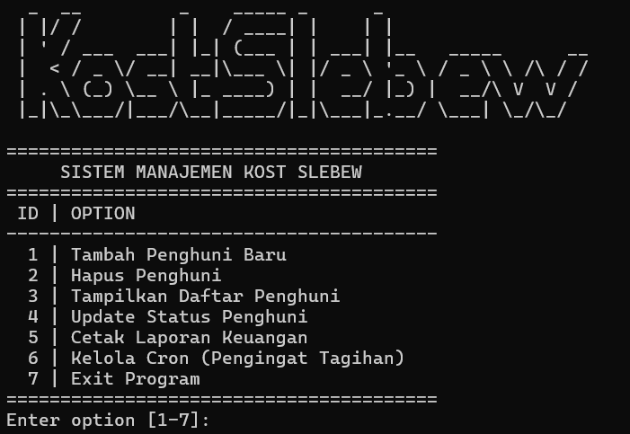

2. Opsi 1
	- Tambah penghuni baru 

	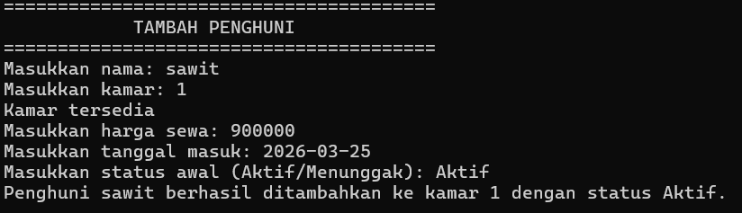

	- Format tanggal tidak sesuai / melebihi hari ini

	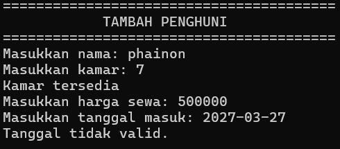

	- Format harga tidak valid

	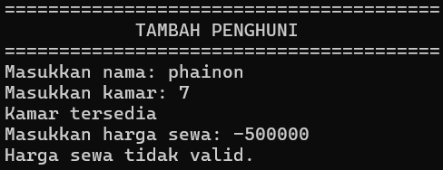

	- Jika kamar tidak tersedia / telah disewa

	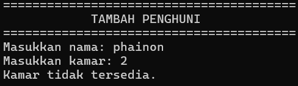

	- Jika status tidak valid

	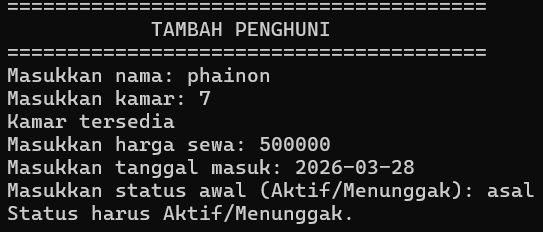

3.  Opsi 2 - Hapus Penghuni 

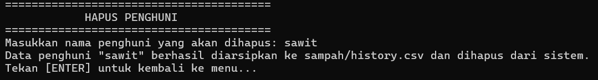

4. Riwayat hapus penghuni 

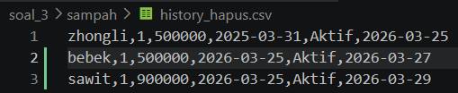

5. Opsi 3 - Daftar penghuni kost 

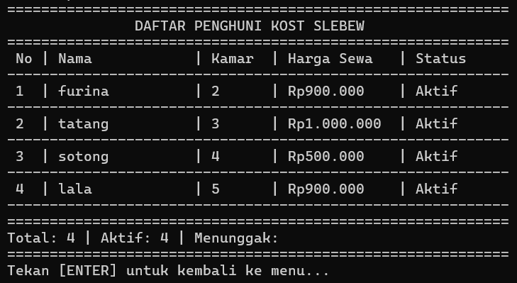

6. Opsi 4 - Update Status

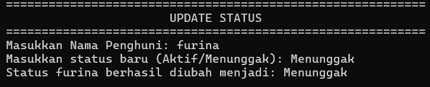

7. Opsi 5 - Laporan keuangan

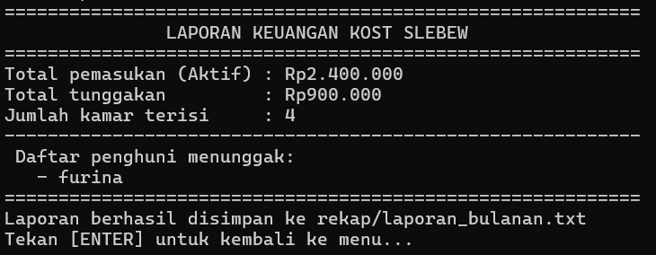

8. Opsi 6 - Cronjob Pengingat Tagihan

	- Menu utama 

	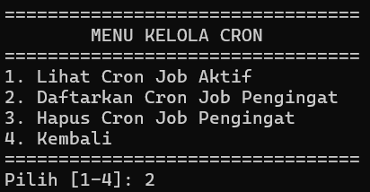

	- Daftarkan cronjob

	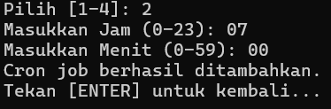

	- Lihat cronjob aktif

	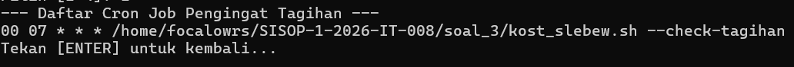

	- Hapus cronjob

	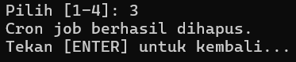

9. Opsi 7 - Keluar program

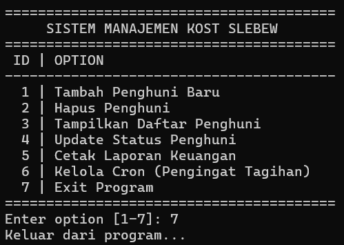

#### Revisi
Terdapat kesalahan dalam format log tagihan yang seharusnya dalam bentuk **[YYYY-MM-DD HH:MM:SS] TAGIHAN: <Nama> (Kamar <Kamar>) - Menunggak Rp<Harga_Sewa>** namun format sebelumnya hanya mencatat nama penghuni dan statusnya saja.
Berikut script saya sebelum revisi.
```shell 
if [ "$1" == "--check-tagihan" ]; then
    awk -F',' '$5=="Menunggak" {print $1 " menunggak"}' data/penghuni.csv >> log/tagihan.log
    exit 0
fi
```
Kesalahan ini diperbaiki dengan menambahkan format tersebut ke dalam script. Berikut script setelah memperbaiki kesalahan sebelumnya.
```shell
if [ "$1" == "--check-tagihan" ]; then
    awk -F',' '$5=="Menunggak" {cmd = "date \"+[%Y-%m-%d %H:%M:%S]\""
        cmd | getline timestamp
        close(cmd)
        print timestamp " TAGIHAN: " $1 " (Kamar " $2 ") - Menunggak Rp" $3}' data/penghuni.csv >> log/tagihan.log
    exit 0
fi
```

#### Kendala 
tidak ada kendala.